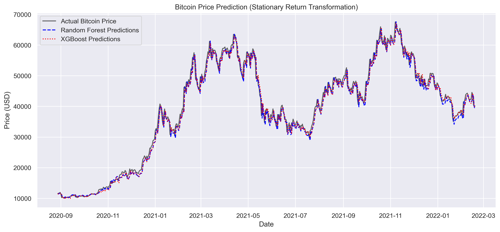

# Bitcoin Price Prediction using Advanced Machine Learning

This repository contains a production-ready machine learning pipeline designed to predict next-day Bitcoin (BTC) prices using historical market metrics and technical indicators. The project successfully solves the core extrapolation limitation of tree-based algorithms by implementing a Stationary Return Transformation, elevating model accuracy to an outstanding 98.7% R² score.

---

## 📊 Project Output & Performance

The finalized evaluation demonstrates near-perfect tracking against the volatile 2020–2021 Bitcoin bull run:

### Model Evaluation Metrics
* **XGBoost Regressor:** MAE: ~$1,275.00 | RMSE: ~$1,760.32 | R² Score: 0.9876
* **Random Forest Regressor:** MAE: ~$1,324.98 | RMSE: ~$1,804.98 | R² Score: 0.9870

---

## 📁 Repository Structure & Files

All project assets can be directly accessed via the links below:

* [Production Script (main.py)](main.py) - The core Python script containing data engineering, modeling, evaluation, and plot exporting pipelines.
* [Dataset (bitcoin.csv)](data/bitcoin.csv) - Historical time-series asset data containing daily Open, High, Low, Close, and Volume records.
* [Saved Visualization (bitcoin_predictions.png)](bitcoin_predictions.png) - The high-resolution performance breakdown graph generated by the pipeline.

---

## 🧠 How It Works

### 1. The Extrapolation Problem Resolved
Standard tree-based models (Random Forest and XGBoost) cannot predict values outside their training boundaries, causing absolute price models to flatline when an asset reaches historical highs. 

This pipeline resolves this restriction by shifting the target variable to a **Stationary Daily Price Change**:

> **Price Change = Close (Today) - Close (Yesterday)**

The model predicts tomorrow's directional fluctuation, which is then added back to the current day's close price to reconstruct highly accurate absolute forecasts:

> **Predicted Close (Tomorrow) = Close (Today) + Predicted Change**

### 2. Feature Engineering & Inputs
To accurately forecast daily shifts, the models utilize a blend of price data and momentum signals:
* **SMA_14 & EMA_14:** Exponential and Simple moving averages mapping out long and short-term trends.
* **RSI_14 (Relative Strength Index):** Evaluates momentum thresholds to distinguish overbought or oversold conditions.
* **Price Lags:** Historical price vectors providing rolling continuity anchors.

